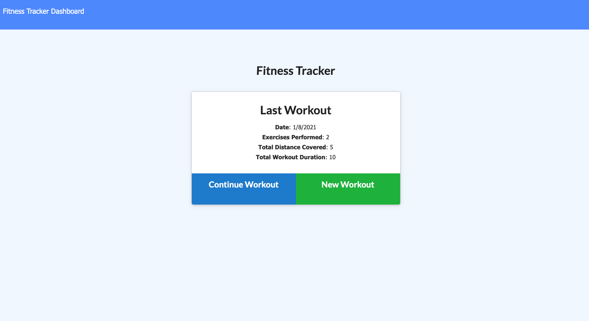
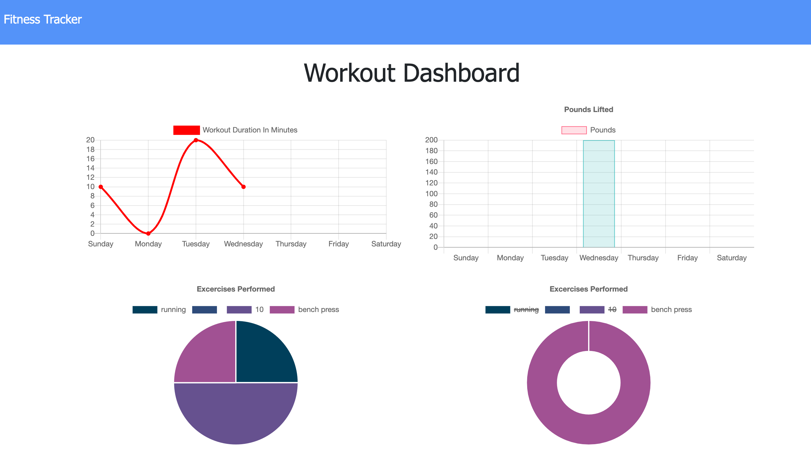
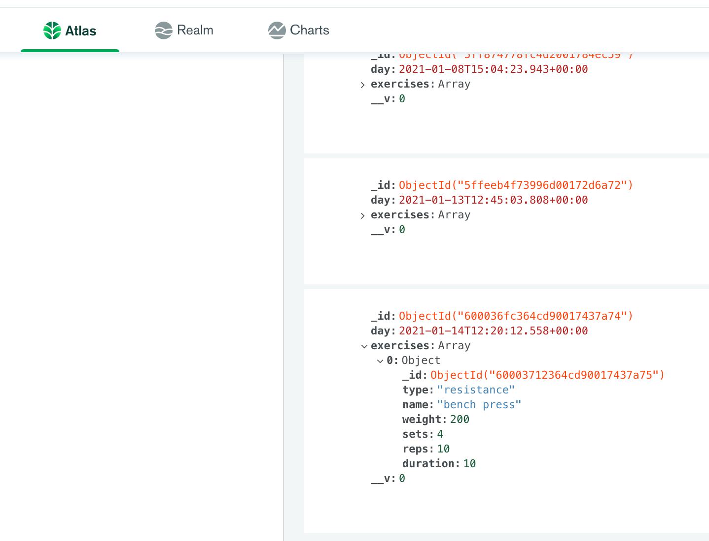

# fitnessTracker !

[View App](https://fitness-tracker-at.herokuapp.com/)

## Description

This app uses mongoDB to store previous workouts and create new workouts. This is an app which allows users to create a workout and keep track of the workouts they have completed. 

This app allows users to view create and track daily workouts. User will be able to log multiple exercises in a workout on a given day and be able to track the name, type, weight, sets, reps, and duration of exercise. For cardio workout, the app will track the distance traveled.

## Table of Contents

* [Installation](#installation)
* [Questions](#questions)

## Installation

The command that should be run to install dependencies is: 
`npm i` and `npm start`

## Questions

If you have any further questions regarding this project, please feel free to contact.

GitHub Username: ashvinit
Email Address: ashvinithomas@gmail.com

